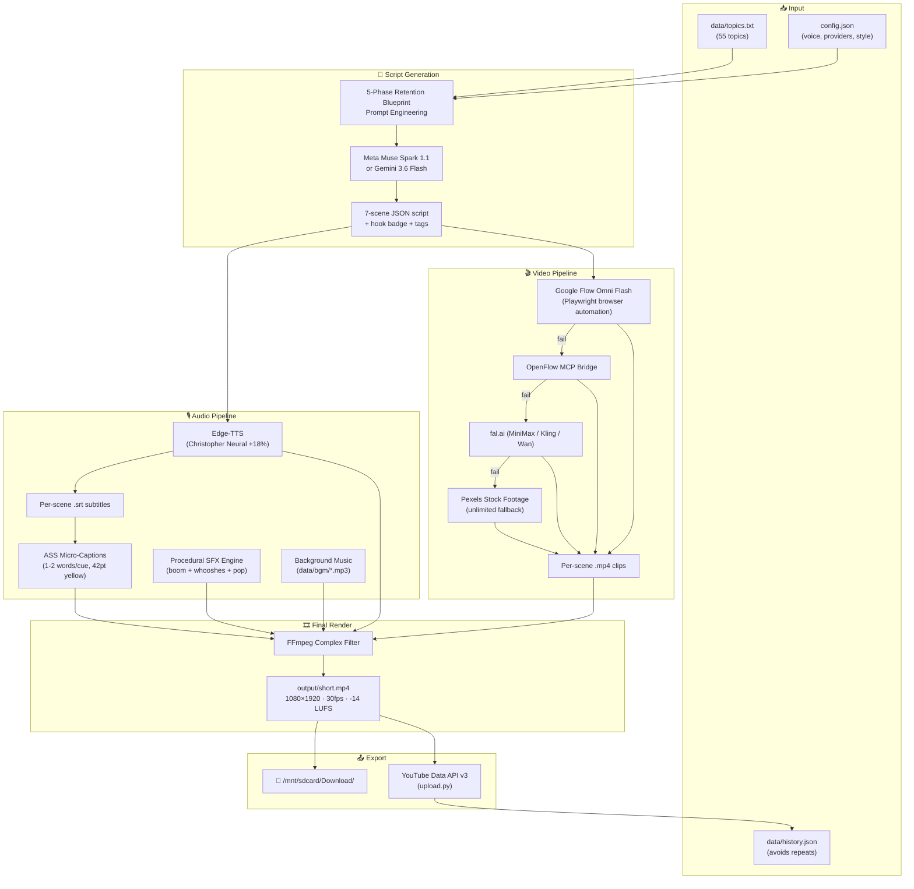
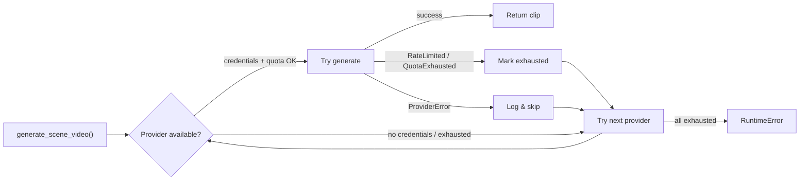
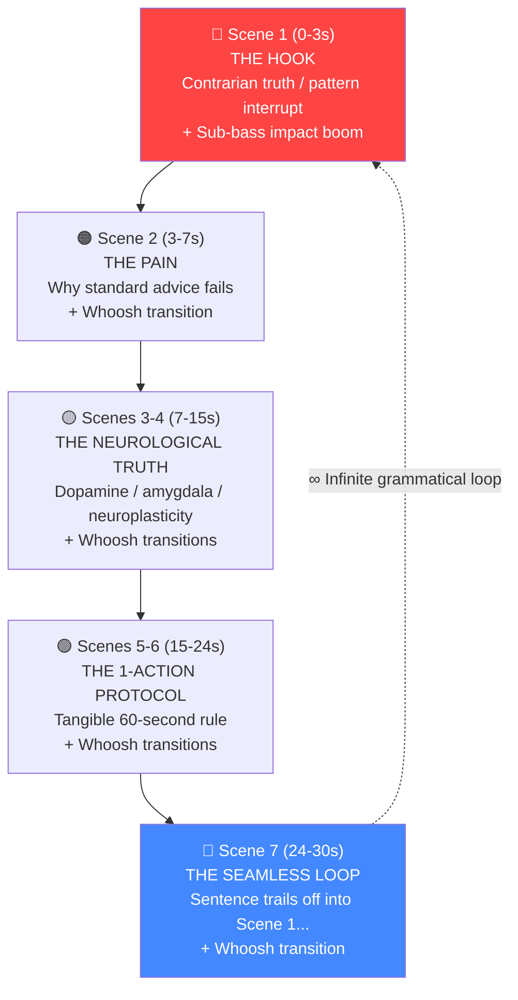

# Idlevelocity Shorts Automation — Full Pipeline Documentation

> **Repository:** [idlevelocity-shorts-automation](https://github.com/prashant-rajpu/idlevelocity-shorts-automation)
> **Runtime:** Python 3.12 + Node.js on headless Android (Termux PRoot, `aarch64`)
> **Last Updated:** 2026-09-25

---

## Table of Contents

1. [What This Does](#what-this-does)
2. [Architecture Overview](#architecture-overview)
3. [Project Structure](#project-structure)
4. [Pipeline Stages](#pipeline-stages)
   - [Stage 1 — Topic Selection](#stage-1--topic-selection)
   - [Stage 2 — Script Generation](#stage-2--script-generation)
   - [Stage 3 — Voice Synthesis & Captions](#stage-3--voice-synthesis--captions)
   - [Stage 4 — AI Video Generation](#stage-4--ai-video-generation)
   - [Stage 5 — Sound Design (SFX)](#stage-5--sound-design-sfx)
   - [Stage 6 — Final Render & Audio Mix](#stage-6--final-render--audio-mix)
   - [Stage 7 — YouTube Upload](#stage-7--youtube-upload)
5. [Video Provider Chain](#video-provider-chain)
6. [Google Flow Direct Automation](#google-flow-direct-automation)
7. [Retention Engineering](#retention-engineering)
8. [Audio Engineering](#audio-engineering)
9. [Configuration Reference](#configuration-reference)
10. [Environment Variables](#environment-variables)
11. [How to Run](#how-to-run)
12. [Output Artifacts](#output-artifacts)

---

## What This Does

**Idlevelocity Shorts Automation** is a fully automated pipeline that generates, renders, and uploads YouTube Shorts from scratch — no manual editing required. Each run:

1. Picks a fresh self-improvement topic
2. Writes a psychologically-engineered script using AI (Meta Muse Spark or Gemini)
3. Generates voiceover narration with Edge-TTS
4. Produces AI video clips for each scene (Google Flow Omni Flash, fal.ai, etc.)
5. Mixes procedural sound effects (sub-bass impact boom + transition whooshes)
6. Renders the final 1080×1920 vertical Short with micro-captions and sidechain-ducked BGM
7. Uploads directly to YouTube via the Data API

The entire pipeline runs on a phone via Termux — no cloud server needed.

---

## Architecture Overview



---

## Project Structure

```
idlevelocity-shorts-automation/
├── config.json                    # Channel settings, provider chain, voice, style
├── .env                           # API keys (gitignored)
├── .gitignore
│
├── data/
│   ├── topics.txt                 # 55 topic ideas (one per line)
│   ├── history.json               # Previously used topics + YouTube video IDs
│   ├── provider_quotas.json       # Daily/weekly quota tracking per provider
│   ├── flow_cookies.json          # Google Flow authenticated session (gitignored)
│   ├── generate_bgm.py            # Utility to generate BGM tracks
│   ├── bgm/                       # Background music tracks
│   │   ├── action_pulse.mp3
│   │   ├── ambient_focus.mp3
│   │   ├── drive_energy.mp3
│   │   └── lofi_chill.mp3
│   └── sfx/                       # Procedurally generated sound effects
│       ├── impact_boom.wav        # 60Hz sub-bass hit (1.2s)
│       ├── whoosh_transition.wav  # Filtered white-noise sweep (0.35s)
│       └── accent_pop.wav         # 1400Hz click (0.08s)
│
├── src/
│   ├── generate.py                # Main pipeline orchestrator (652 lines)
│   ├── video_providers.py         # 11-provider video generation chain (750 lines)
│   ├── flow_direct.js             # Google Flow Playwright browser automation (156 lines)
│   ├── sfx_generator.py           # Procedural FFmpeg SFX engine (88 lines)
│   ├── upload.py                  # YouTube Data API uploader (87 lines)
│   └── trend_research.py          # YouTube trending signals analyzer (170 lines)
│
└── output/                        # Generated artifacts (gitignored)
    ├── short.mp4                  # Final rendered Short
    ├── metadata.json              # Title, description, tags, scenes
    ├── voice.mp3                  # Concatenated voiceover
    ├── captions.ass               # ASS subtitle file
    ├── sfx_track.wav              # Aligned SFX track
    ├── stock_synced.mp4           # Concatenated video track
    ├── scene_*_audio.mp3          # Per-scene voice clips
    ├── scene_*_subs.srt           # Per-scene SRT subtitles
    ├── raw_scene_*.mp4            # Raw AI-generated clips
    └── synced_scene_*.mp4         # Time-matched scene clips
```

---

## Pipeline Stages

### Stage 1 — Topic Selection

**File:** [`src/generate.py`](src/generate.py) → `choose_topic()`

1. Reads all topics from `data/topics.txt` (55 curated topics).
2. Checks `data/history.json` to exclude previously used topics.
3. If unused topics remain, picks one randomly.
4. If all topics are exhausted, calls the LLM to generate a fresh trending topic and appends it to `topics.txt`.

### Stage 2 — Script Generation

**File:** [`src/generate.py`](src/generate.py) → `generate_script()`

Sends a heavily-engineered prompt to the text LLM requesting a JSON script with:

- **5-Phase Retention Blueprint** (see [Retention Engineering](#retention-engineering))
- 6-7 scenes, each with exactly 10-14 spoken words
- A `hook_badge` (e.g., "⏳ PERFECT TIMING KILLS YOU")
- Per-scene `cinematic_prompt` for AI video generation
- Per-scene `visual_query` for stock footage fallback
- 12-15 SEO tags
- A `loop_connection` explaining how the last scene grammatically flows into Scene 1

**Text providers (in priority order):**

| Provider | Model | Env Var |
|----------|-------|---------|
| Meta AI | `muse-spark-1.1` | `META_API_KEY` |
| Google Gemini | `gemini-3.6-flash` | `GEMINI_API_KEY` |

### Stage 3 — Voice Synthesis & Captions

**File:** [`src/generate.py`](src/generate.py) → `generate_scene_audio_and_ass()`

For each scene:

1. **Edge-TTS** synthesizes speech using `en-US-ChristopherNeural` voice at `+18%` rate.
2. Edge-TTS also produces a `.srt` subtitle file with word-level timing.
3. The SRT is parsed and split into **1-2 word micro-captions** (Hormozi/MrBeast rapid pop style).
4. All per-scene audio files are concatenated into a single `voice.mp3`.
5. An ASS subtitle file is generated with:
   - **HookBadge style:** 38pt white, top-area, shown for first 3.5s
   - **CaptionText style:** 42pt vibrant yellow (`&H0000FFFF`), 5px black outline, positioned at `MarginV=420` to clear YouTube UI overlays

### Stage 4 — AI Video Generation

**File:** [`src/video_providers.py`](src/video_providers.py) → `generate_scene_video()`

For each scene, the pipeline tries video providers in chain order until one succeeds:

| Priority | Provider | Method | Limits |
|----------|----------|--------|--------|
| 1 | **Google Flow Direct** | Playwright browser automation | Unlimited (Google AI Pro) |
| 2 | OpenFlow Omni Flash | MCP API bridge | 3/week (free tier) |
| 3 | OpenFlow Image→Video | MCP + Ken Burns zoom | 3/week (free tier) |
| 4 | fal.ai MiniMax H3 Max | REST API queue | 5/day |
| 5 | fal.ai Kling 2.5 Turbo | REST API queue | Credit-based |
| 6 | fal.ai Wan 2.6 | REST API queue | Credit-based |
| 7 | HuggingFace LTX-Video | Inference Providers | Free credits |
| 8 | Replicate LTX-Video | REST API | Signup credit |
| 9 | Pixverse | REST API | Daily quota |
| 10 | **Pexels Stock** | REST API | **Unlimited** (last resort) |

Each raw clip is then FFmpeg-processed to match the exact scene duration:
- Scale to 1080×1920 (9:16 vertical)
- Loop short clips to fill duration
- Encode with libx264, 30fps

All clips are concatenated into `stock_synced.mp4`.

### Stage 5 — Sound Design (SFX)

**File:** [`src/sfx_generator.py`](src/sfx_generator.py)

Generates procedural sound effects using FFmpeg's `lavfi` audio filters (zero external dependencies):

| SFX | Description | FFmpeg Filter | Duration |
|-----|-------------|---------------|----------|
| `impact_boom.wav` | Deep 60Hz sub-bass hit | `sine=frequency=60` + fade out | 1.2s |
| `whoosh_transition.wav` | Filtered white-noise sweep | `anoisesrc` + `bandpass=f=1200` | 0.35s |
| `accent_pop.wav` | High-frequency click | `sine=frequency=1400` | 0.08s |

`build_sfx_track()` creates an aligned composite track:
- **Impact boom** at `t=0.0s` (opening hook emphasis)
- **Whoosh transition** at every scene cut boundary (using `adelay` filter)
- All mixed with `amix` into a single `sfx_track.wav`

### Stage 6 — Final Render & Audio Mix

**File:** [`src/generate.py`](src/generate.py) → `render_final_video_openmontage()`

A single FFmpeg command combines all 4 inputs into the final Short:

```
Input 0: stock_synced.mp4    (concatenated video)
Input 1: voice.mp3           (narration)
Input 2: bgm/*.mp3           (background music, looped)
Input 3: sfx_track.wav       (boom + whooshes)
```

**FFmpeg filter graph:**

```
[0:v] → scale/crop/subtitles → [vout]

[2:a] → volume(0.14) → [bgm_raw]
[bgm_raw] + [1:a] → sidechaincompress → [ducked_bgm]
[1:a] + [ducked_bgm] + [3:a] → amix(3) → loudnorm(-14 LUFS) → [aout]
```

**Audio mix breakdown:**

| Track | Processing |
|-------|-----------|
| Voice | Center, high-clarity, used as sidechain key |
| BGM | Volume at 14%, ducked -14dB during speech via `sidechaincompress` (threshold=0.12, ratio=4.5, attack=15ms, release=220ms) |
| SFX | Mixed at full volume, placed at scene boundaries |
| Master | EBU R128 loudnorm at `-14 LUFS`, true peak `-1.0 dBFS` |

**Output specs:**
- Resolution: 1080×1920 (9:16)
- Framerate: 30fps
- Video: H.264, CRF 22, veryfast preset
- Audio: AAC 192kbps
- Container: MP4 with `+faststart` for streaming

### Stage 7 — YouTube Upload

**File:** [`src/upload.py`](src/upload.py)

- Authenticates with YouTube Data API v3 via OAuth2 refresh token.
- Uploads `output/short.mp4` with metadata from `output/metadata.json`.
- Appends the topic and video ID to `data/history.json` to prevent duplicates.
- Sets privacy to public, category 27 (Education).

---

## Video Provider Chain

The provider system is built on a common `VideoProvider` abstract base class with automatic failover:



Quotas are persisted in `data/provider_quotas.json` to avoid wasting HTTP calls on known-exhausted providers.

---

## Google Flow Direct Automation

**File:** [`src/flow_direct.js`](src/flow_direct.js)

This is the #1 provider. It automates the Google Flow Studio web UI using Playwright and the user's authenticated cookies (Google AI Pro subscription → unlimited Omni Flash 1.1 generations).

**How it works:**

1. Launches headless Chromium with `--no-sandbox` flags (PRoot compatibility).
2. Injects session cookies from `data/flow_cookies.json`.
3. Navigates to the user's Google Flow project (`flow.google.com/project/...`).
4. Fills the ProseMirror prompt editor with the scene's cinematic prompt.
5. Records the current count of "Download batch" buttons on the page.
6. Clicks "Start generation".
7. Polls every 4 seconds until a **new** download button appears (count > initial).
8. Waits 2 seconds for UI settle, then triggers download.
9. Saves the `.zip`, extracts the `.mp4`, copies to the target path.

**Why this exists:** The OpenFlow MCP bridge (`openflowmcp.com`) artificially caps free users at 3 videos/week. Google Flow directly has **no such limit** with Google AI Pro.

---

## Retention Engineering

The script prompt enforces a **5-Phase Retention Blueprint** designed to maximize YouTube Shorts Average Percentage Viewed (APV) above 100%:



**Loop example:**
- Scene 1: *"Perfect timing is a myth designed to keep you comfortable..."*
- Scene 7: *"Real winners start ugly and messy now instead of waiting, and that's exactly why"*
- On replay: *"...and that's exactly why perfect timing is a myth..."*

This creates a seamless loop that tricks the viewer's brain into watching 2-3x, driving APV above 100%.

---

## Audio Engineering

### Voice
- **Engine:** Microsoft Edge-TTS (free, high-quality neural voices)
- **Voice:** `en-US-ChristopherNeural` (deep, authoritative)
- **Rate:** `+18%` (fast, urgent cadence — Huberman/Hormozi style)

### Background Music
- 4 pre-generated tracks in `data/bgm/` (energy, pulse, ambient, lofi)
- Preference for "energy" or "pulse" tracks (matched to high-retention content)
- Volume set to 14% of original (subtle bed, not distracting)

### Sidechain Ducking
- BGM is dynamically compressed using voice as the sidechain key
- Parameters: `threshold=0.12, ratio=4.5, attack=15ms, release=220ms`
- BGM naturally swells during micro-pauses between scenes

### Loudness Normalization
- EBU R128 standard via FFmpeg `loudnorm` filter
- Target: `-14 LUFS` integrated, `-1.0 dBFS` true peak, `LRA=11 LU`
- Optimized for YouTube Shorts / Instagram Reels playback

---

## Configuration Reference

**File:** [`config.json`](config.json)

```json
{
  "channel_name": "Idlevelocity",
  "language": "English",
  "target_region": "US / Global Tier-1",
  "niche": "high-performance habits, self-discipline, dopamine detox, productivity and mindset psychology",
  "voice": "en-US-ChristopherNeural",
  "speech_rate": "+18%",
  "bgm_volume": 0.14,
  "subtitle_font_size": 28,
  "subtitle_color": "yellow",
  "multi_clip": true,
  "clip_count": 6,
  "privacy_status": "public",
  "category_id": "27",
  "duration_target_seconds": 32,
  "hashtags": ["#shorts", "#selfimprovement", "#discipline", "#productivity", "#mindset", "#habits", "#success"],
  "video_providers": [
    "google_flow_direct",
    "openflow_omniflash",
    "openflow_veo",
    "openflow_image",
    "fal_minimax_h3max",
    "fal_kling25_turbo",
    "fal_wan",
    "hf_ltx",
    "replicate_ltx",
    "pexels"
  ],
  "style_prefix": "Cinematic 3D animated style, Pixar-quality lighting...",
  "provider_overrides": {}
}
```

---

## Environment Variables

**File:** `.env` (gitignored)

| Variable | Required | Purpose |
|----------|----------|---------|
| `META_API_KEY` | ✅ (or Gemini) | Meta Muse Spark script generation |
| `GEMINI_API_KEY` | ✅ (or Meta) | Gemini 3.6 Flash script generation |
| `OPENFLOW_TOKEN` | Optional | OpenFlow MCP bridge (3 videos/week cap) |
| `YOUTUBE_CLIENT_ID` | For upload | YouTube Data API OAuth2 |
| `YOUTUBE_CLIENT_SECRET` | For upload | YouTube Data API OAuth2 |
| `YOUTUBE_REFRESH_TOKEN` | For upload | YouTube Data API OAuth2 |
| `HUGGINGFACE_API_KEY` | Optional | HuggingFace LTX-Video provider |
| `FAL_KEY` | Optional | fal.ai video generation |
| `PEXELS_API_KEY` | Optional | Pexels stock footage fallback |
| `REPLICATE_API_TOKEN` | Optional | Replicate LTX-Video provider |
| `PIXVERSE_API_KEY` | Optional | Pixverse video generation |

Google Flow Direct uses **cookie-based auth** via `data/flow_cookies.json` (not an env var).

---

## How to Run

### Generate a Short
```bash
cd /root/idlevelocity-shorts-automation
.venv/bin/python src/generate.py
```

This runs the full pipeline and:
- Saves the final video to `output/short.mp4`
- Auto-exports to `/mnt/sdcard/Download/idlevelocity_retention_short.mp4`
- Writes metadata to `output/metadata.json`

### Upload to YouTube
```bash
.venv/bin/python src/upload.py
```

### Generate SFX Only
```bash
.venv/bin/python src/sfx_generator.py
```

### Run Trend Research
```bash
.venv/bin/python src/trend_research.py
```

---

## Output Artifacts

After a successful run, `output/` contains:

| File | Description | Size (typical) |
|------|-------------|----------------|
| `short.mp4` | **Final rendered Short** (upload-ready) | 8-12 MB |
| `metadata.json` | Title, description, narration, scenes, tags | ~5 KB |
| `voice.mp3` | Full concatenated voiceover | ~200 KB |
| `captions.ass` | ASS subtitle file with micro-captions | ~4 KB |
| `sfx_track.wav` | Aligned sound design (boom + whooshes) | ~2.8 MB |
| `stock_synced.mp4` | Concatenated video track (no audio) | ~10 MB |
| `scene_N_audio.mp3` | Individual scene voiceover clips | ~30 KB each |
| `scene_N_subs.srt` | Individual scene SRT subtitles | ~1 KB each |
| `raw_scene_N.mp4` | Raw AI-generated video clips | varies |
| `synced_scene_N.mp4` | Time-matched, scaled scene clips | ~1.5 MB each |
